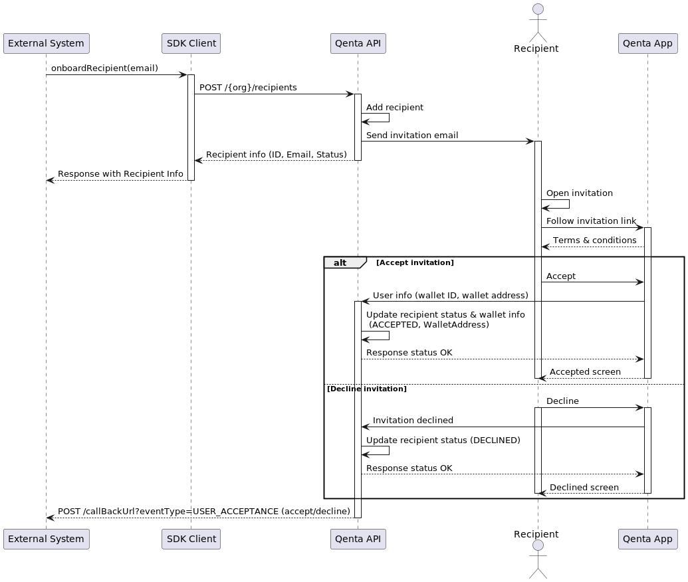

# Recipients
## Glossary of terms
- Recipiens: Refers to an individual that receives funds or payments from a ProWallet account. When a payment disbursement is made, the recipient is the intended beneficiary who receive the the transaction.

## Functional requirement:
The payment disbursement system is responsible for processing and transferring funds securely and accurately to the designated recipients as per the instructions or rules set by the sender or the system administrator. It ensures that the funds reach the correct recipients in a timely and efficient manner.


## Functional Requirements
1. Create Recipient: The system provide a function to create a new recipient with required information such as name, email, and wallet address.

2. Get Recipients: The system provide a function to fetch the list of all recipients.

3. Get Recipient: The system provide a function to fetch the details of a specific recipient by their ID. 

## Non-Functional Requirements

1. Security: The system ensure that the data of the recipients is secure and not accessible to unauthorized users.

2. Usability: The system be easy to use and the functions should be easily accessible to the users.

3. Reliability: The system is reliable and should perform consistently under different conditions.

## Get recipient info

You can get the information about a specific Recipient using the `ID` or the `Email` address.

If the recipient is found the method will return a `RecipientInfo` instance with follow information:

### RecipientInfo

| Field      | Type          | Description                                                                |
|------------|---------------|----------------------------------------------------------------------------|
| `ID`       | Number (Long) | Unique identifier of the recipient                                         |
| `Email`    | String        | Email address of the recipient                                             |
| `Status`   | String        | Status of the recipient: `CREATED` `INVITATION_SENT` `ACCEPTED` `DECLINED` |
| `Language` | String        | Language use to communication with the recipient                           |

<br/>


### Using SDK

You can use the `getRecipientInfo(...)` method to perform this action.

```java
class GetRecipientInfoClient {
    private final QentaClient qentaClient;
    
    public RecipientInfo getRecipientInfo() {
        GetRecipientInfoRequest request = new GetRecipientInfoRequest(123L);
        GetRecipientInfoResponse response = qentaClient.getRecipientInfo(request);
        if (!response.isSuccess()) {
            throw new RuntimeException(response.getErrorMessage());
        }
        response.getRecipient();
    }
    
}
```

The `getRecipientInfo(...)` method could initiate the onboard process if the recipient _is not found_, to do this `GetRecipientInfoRequest` object includes the `createIfNotFound` flag, all you need you to do is set as `true`.

```java
class GetRecipientInfoClient {
    private final QentaClient qentaClient;
    
    public RecipientInfo getRecipientInfo() {
        GetRecipientInfoRequest request = new GetRecipientInfoRequest("recipient@email.com")
                .setOnboardIfNotFound(true);//This flag will trigger the onboard flow if the recipient not found
        
        GetRecipientInfoResponse response = qentaClient.getRecipientInfo(request);
        //Here goes the response processing logic
    }
    
}
```

As you can see in the samples above, to instantiate the `GetRecipientInfoRequest` you need to provide either the `ID` or the `Email` of the `Recipient`.

> In case you set the `onboardIfNotFound` flag as `true` you need to provide the email address.

## Onboard a recipient

Overall, this sequence represents the `Recipient onboarding` process where an `External System` initiates the process, a recipient is created using the SDK client.

The recipient will receive an invitation via email with a link that take him to the QentaApp, from here the recipient can either accept or decline the invitation, and their status is updated accordingly.

The  `External System` is also notified about the recipient's acceptance or decline via the `callback URL`.



### Using the SDK

To perform the onboard you need to use the `onboardRecipient(...)` method.

```java
class OnboardRecipientSample {
    
    private final QentaClient qentaClient;
     
    void onboardRecipientMethod() {
        OnboardRecipientRequest request = new OnboardRecipientRequest("address@mail.com")
                .withLanguage("en-US");//Language for the notifications to the recipient, by default is 'en-US'
        OnboardRecipientResponse response = qentaClient.onboardRecipient(request);
        
        if (!response.isSuccessful()){
            throw new RuntimeException(response.getErrorMessage());
        }
        
        RecipientInfo info = response.getRecipient();
        
        if (info.getStatus() == RecipientStatus.INVITATION_SENT) {
            System.out.println("The invitation was sent to %s".formatted(info.getEmail()));
        }
        
        if (info.getStatus() == RecipientStatus.CREATED) {
            System.out.println("The recipient was created but the invitation wasn't sent");
        }
        
    }
    
}
```

The `OnboardRecipientRequest` only requires the `email` of the recipient. You can specify the `language` for the notifications as well, this last field is not mandatory.

The `OnboardRecipientResponse`, if success, will include the [RecipientInfo](Readme.md#recipientinfo) object.