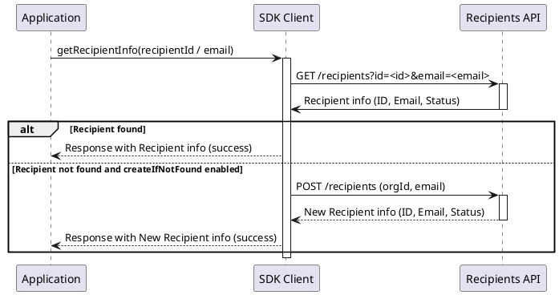

# Recipients

## Onboard a recipient

```puml
@startuml

participant Application
participant "SDK Client" as SdkClient
participant "Recipients API" as RecipientsAPI

Application -> SdkClient: getRecipientInfo(recipientId / email)
activate SdkClient

SdkClient -> RecipientsAPI: GET /recipients?id=<id>&email=<email>
activate RecipientsAPI

RecipientsAPI -> SdkClient: Recipient info (ID, Email, Status)
deactivate RecipientsAPI

alt Recipient found
SdkClient --> Application: Response with Recipient info (success)
else Recipient not found and createIfNotFound enabled
SdkClient -> RecipientsAPI: POST /recipients (orgId, email)
activate RecipientsAPI
RecipientsAPI --> SdkClient: New Recipient info (ID, Email, Status)
deactivate RecipientsAPI

    SdkClient --> Application: Response with New Recipient info (success)
end

deactivate SdkClient
@enduml
```
