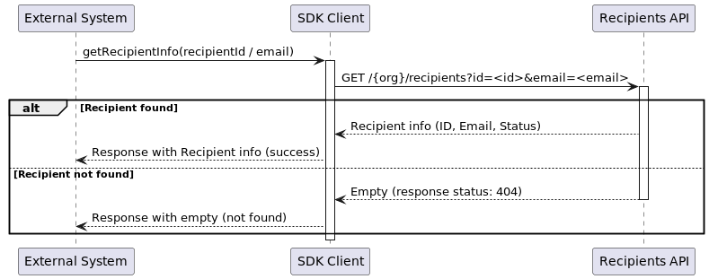
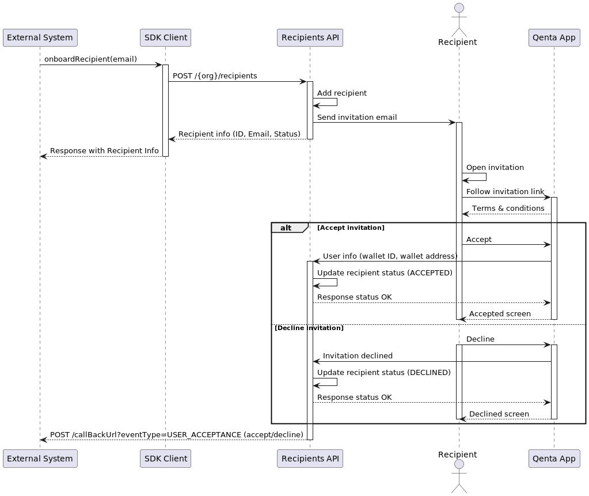

# Recipients

## Get recipient info

You can get the information about a specific Recipient using the `ID` or the `Email` address.

If the recipient is found the SDK will return the follow information:

<br/>

| Field | Type | Description                        |
|-------|------|------------------------------------|
| `ID` | Number (Long) | Unique identifier of the recipient |
| `Email` | String | Email address of the recipient     |
| `Status`| String | Status of the recipient: `CREATED` `INVITATION_SENT`|

<br/>



You can use the `getRecipientInfo(...)` method to perform this action.

```java
class GetRecipientInfoClient {
    private final QentaClient qentaClient;
    
    public RecipientInfo getRecipientInfo() {
        GetRecipientInfoRequest request = new GetRecipientInfoRequest(123L);
        GetRecipientInfoResponse response = qentaClient.getRecipientInfo(request);
        if (!response.isSuccess()) {
            throw new RuntimeException(response.getErrorMessage());
        }
        response.getRecipient();
    }
    
}
```

The `getRecipientInfo(...)` method could initiate the onboard process if the recipient _is not found_, to do this `GetRecipientInfoRequest` object includes the `createIfNotFound` flag, all you need you to do is set as `true`.

```java
class GetRecipientInfoClient {
    private final QentaClient qentaClient;
    
    public RecipientInfo getRecipientInfo() {
        GetRecipientInfoRequest request = new GetRecipientInfoRequest("recipient@email.com")
                .setOnboardIfNotFound(true);//This flag will trigger the onboard flow if the recipient not found
        
        GetRecipientInfoResponse response = qentaClient.getRecipientInfo(request);
        //Here goes the response processing logic
    }
    
}
```

As you can see in the samples above, to instantiate the `GetRecipientInfoRequest` you need to provide either the `ID` or the `Email` of the `Recipient`.

> In case you set the `onboardIfNotFound` flag as `true` you need to provide the email address.

## Onboard a recipient

Overall, this sequence represents the `Recipient onboarding` process where an `External System` initiates the process, a recipient is created using the SDK client.

The recipient will receive an invitation via email with a link that take him to the QentaApp, from here the recipient can either accept or decline the invitation, and their status is updated accordingly.

The  `External System` is also notified about the recipient's acceptance or decline via the `callback URL`.


