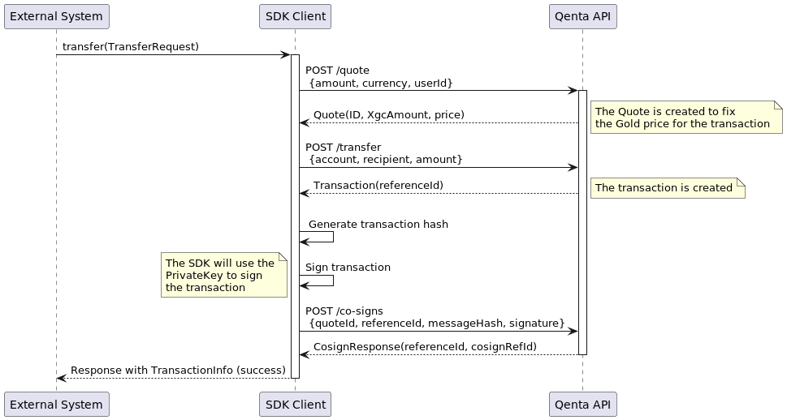
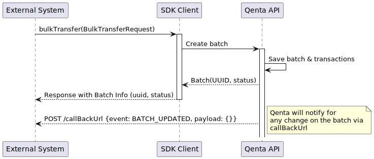

# Transaction Batches

## Introduction

The Payment Disbursement System SDK provides a set of functionalities for developers to integrate secure and efficient payment disbursement capabilities into their applications. This documentation focuses on the "Transactions" functionality, which enables users to initiate, process, and track payment disbursements to recipients.

## Key Concepts

- Transaction: A transaction represents a single payment disbursement from the payer to the recipient. It contains essential information such as the transaction ID, recipient email, amount, status, currency (USD) and timestamps.

- Batch: Refers to a method of processing multiple payment disbursements simultaneously as a single group or batch. Instead of initiating individual transactions one by one, a batch transaction allows developers to streamline the process and send payments to multiple recipients at once, typically in a single call.

- Recipient: The recipient is the individual or entity receiving the payment disbursement. Recipient details include the recipient's unique identifier (email) and optional metadata.

- Wallet: allows you to identify the account with which you can carry out transactions with Responsible gold. Both in the business field, through its Pro wallet, and in retail through its B2C wallet or also called Qenta app. 

- Transaction Status: The status of a transaction indicates its current stage in the payment process. Common statuses include "PENDING," "APPROVED," "IN PROGRESS,", "FAILED" or "SUCCEEDED"

## About cash-out methods:
Qenta App defines how the disbursement will be made to the recipient. It includes options such as wire transfer (swift), ACH, PayPal and Payoneer.

## Key Characteristics of Transactions:

- Multiple Transactions: A batch transaction can include multiple individual transactions, each representing a payment disbursement to a unique recipient. These transactions are processed as a group within the same API call.

- Efficiency and Speed: Batch transactions improve the efficiency and speed of payment disbursement processing. Instead of making separate API calls for each transaction, the SDK sends a single request with all the necessary transaction details.

- Error Handling: The SDK provides comprehensive error handling for batch transactions. If any individual transaction within the batch encounters an issue (e.g., insufficient funds or invalid recipient details), the SDK will report the error for that specific transaction while continuing to process the rest of the batch.

- Transaction Status and Monitoring: After initiating a batch transaction, developers can monitor the status of each individual transaction within the batch. This allows them to track the progress of payments and identify any failed or pending transactions.

- Transactions are performed in USD, utilizing the available balance in responsible gold from the organization's wallet address. The payment disbursement system ensures that disbursements are made in the currency of USD to maintain consistency and transparency. The organization's wallet acts as the funding source for these transactions, providing the necessary funds to execute payments securely and efficiently. By leveraging the organization's balance, the system ensures that disbursements are processed seamlessly, enabling timely and accurate payments to the intended recipients.

## Individual transactions

A `transaction` is an instruction move funds from an `account` to a specific [recipient](../recipients) or wallet address.



When a `transfer` is performed individually this will be automatically signed using the `Private Key` that was provided in the [_initial configuration_](../../README.md#step-3-initialize-the-qenta-client).

If success, the funds will be transfer to the [recipient](../recipients) immediately and the client will return a `TransactionInfo` instance with the follow information:

### TransactionInfo object

| Field               | Type             | Description                      |
|---------------------|------------------|----------------------------------|
| `ReferenceId`       | String           | Transaction reference ID         |
| `Price`             | Number (Decimal) | Price in USD for the transaction |
| `XgcAmount`         | Number (Decimal) | Amount of Gold transferred       |

### Using the SDK

To perform a transfer invoke the `performTranfer(...)` method in a `QentaClient` instance, supplying an `accountId`, `recipient` and an `amount` in USD Dollars.

You must ensure the `account` where you're going to take the money from has enough balance or an error will be result.


The method required the `TransferRequest` object.

```java
import java.math.BigDecimal;

class TransferServiceSample {
    
    private final QentaClient client;

    void transfer() {
        
        Long accountId;
        //you can use the email for recipient as well
        TransferRequest.Recipient recipient = new TransferRequest.Recipient(123L);
        
        TransferRequest request = new TransferRequest(new BigDecimal("150.65"))
                .fromAccount(accountId)
                .to(recipient);
        //performing the transaction
        TransferResponse response = client.peformTransfer(request);
        
    }

}

```


## Batch transactions

`Transaction batch` allows to perform multiple transaction in once.



Before the batch is created and saved to the database, the `Transaction API` will validate the `account` balance is
enough to support the total amount of all transactions.

Once the batch and its transaction are saved in database, the `Transaction API` will return the follow batch info.

| Field    | Type          | Description                                    |
|----------|---------------|------------------------------------------------|
| `ID`     | Number (Long) | Numeric identifier of the batch                |
| `UUID`   | String        | Large string identifier                        |
| `Name`   | String        | Name of the batch                              |
| `Status` | String        | `PENDING` `APPROVED` `IN_PROGRESS` `SUCCEEDED` |

> When a `batch` is created is in `PENDING` status

After the synchronous part of the process if completed: the batch is created and returned to the `SDK Client`, the `Transaction API` will create asynchronously each transaction on the blockchain.

> At this moment the balance from the `account` will be reserved, but, the `funds`won't be transfer __until the `batch` is approved__.

Finally, when all transactions are created on the blockchain, the `Transaction API` will notify to `External System` via the `callback URL`

### Using the SDK

You can use the `createBatch(...)` method to perform the flow described above.

The method requires the `CreateBatchRequest` object.

You can see a sample of how to create this request:

```java
import java.math.BigDecimal;

class SampleBatch {

    void buildCreateBatchRequest() {

        Long accountId;
        Long recipientId;
        //Here goes the initialization of variables

        CreateBatchRequest.Transaction transactionOne = new CreateBatchRequest.Transaction(recipientId, TransactionCurrency.USD, new BigDecimal("10.00"));

        CreateBatchRequest request = new CreateBatchRequest(accountId)
                .withName("batch name")
                .addTransaction(transactionOne);

        //Use the qentaClient to send the request
    }
    
}
```

To create a batch, first you need to provide the `accountId`, where the `funds` will be taken from, you can specify a name for the batch as well, but this last it's not mandatory.

At least one transaction should be included on the request.


## Add transaction to batch

## Remove a transaction from batch

## Approve a batch

