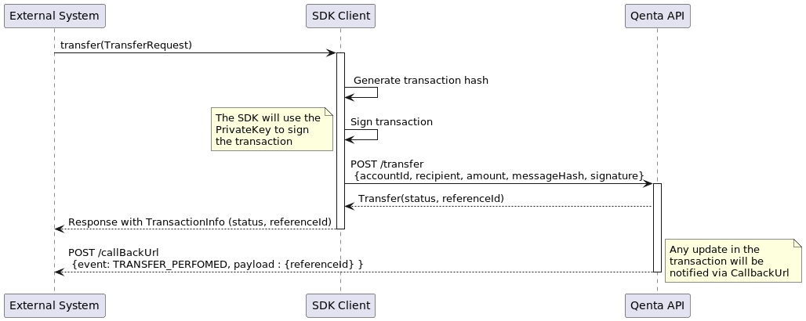

# Transaction Batches

## Individual transactions

A `transaction` is an instruction move funds from an `account` to a specific [recipient](../recipients) or wallet address.



When a `transfer` is performed individually this will be automatically signed using the `Private Key` that was provided in the [_initial configuration_](../../README.md#step-3-initialize-the-qenta-client).

If success, the funds will be transfer to the [recipient](../recipients) immediately and the client will return a `TransactionInfo` instance with the follow information:

### TransactionInfo object

| Field               | Type             | Description                      |
|---------------------|------------------|----------------------------------|
| `ReferenceId`       | String           | Transaction reference ID         |
| `Price`             | Number (Decimal) | Price in USD for the transaction |
| `XgcAmount`         | Number (Decimal) | Amount of Gold transferred       |
| `CosignReferenceId` | String           | Reference of co-sign operation   |

### Using the SDK

To perform a transfer you can invoke the `performTranfer(...)` method in a `QentaClient` instance.


## Batch transactions

`Transaction batch` allows to perform multiple transaction in once.


Before the batch is created and saved to the database, the `Transaction API` will validate the `account` balance is
enough to support the total amount of all transactions.

Once the batch and its transaction are saved in database, the `Transaction API` will return the follow batch info.

| Field    | Type          | Description                                    |
|----------|---------------|------------------------------------------------|
| `ID`     | Number (Long) | Numeric identifier of the batch                |
| `UUID`   | String        | Large string identifier                        |
| `Name`   | String        | Name of the batch                              |
| `Status` | String        | `PENDING` `APPROVED` `IN_PROGRESS` `SUCCEEDED` |

> When a `batch` is created is in `PENDING` status

After the synchronous part of the process if completed: the batch is created and returned to the `SDK Client`, the `Transaction API` will create asynchronously each transaction on the blockchain.

> At this moment the balance from the `account` will be reserved, but, the `funds`won't be transfer __until the `batch` is approved__.

Finally, when all transactions are created on the blockchain, the `Transaction API` will notify to `External System` via the `callback URL`

### Using the SDK

You can use the `createBatch(...)` method to perform the flow described above.

The method requires the `CreateBatchRequest` object.

You can see a sample of how to create this request:

```java
import java.math.BigDecimal;

class SampleBatch {

    void buildCreateBatchRequest() {

        Long accountId;
        Long recipientId;
        //Here goes the initialization of variables

        CreateBatchRequest.Transaction transactionOne = new CreateBatchRequest.Transaction(recipientId, TransactionCurrency.USD, new BigDecimal("10.00"));

        CreateBatchRequest request = new CreateBatchRequest(accountId)
                .withName("batch name")
                .addTransaction(transactionOne);

        //Use the qentaClient to send the request
    }
    
}
```

To create a batch, first you need to provide the `accountId`, where the `funds` will be taken from, you can specify a name for the batch as well, but this last it's not mandatory.

At least one transaction should be included on the request.


## Add transaction to batch

## Remove a transaction from batch

## Approve a batch

